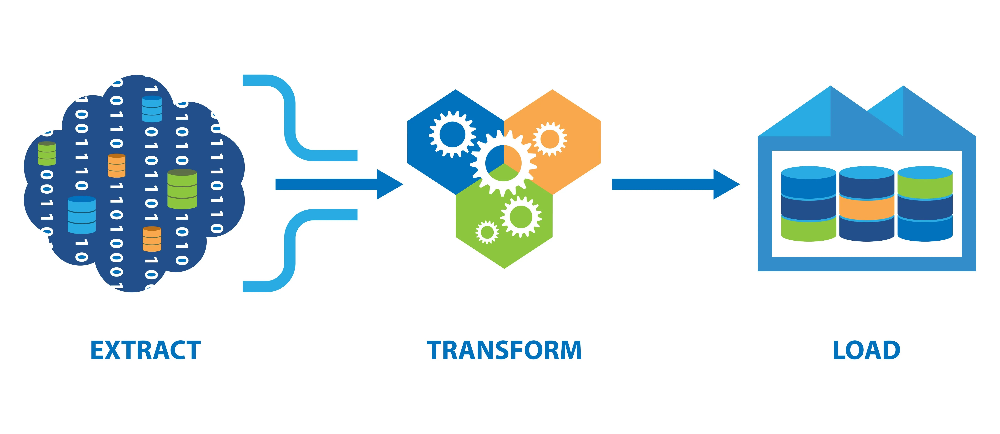

# Crunchyroll ( Anime Streaming Platform ) Meta-Data Data Pipeline 
Before You going through my Project, Please visit Crunchyroll [here](https://www.crunchyroll.com/) and learn about it. 

You can get Extracted and transformed dataset on kaggle [here](  )

## 

 
This project contains three script
- Gathering information from sources ( Data_Extraction.py )
- Wide Spread unstructured files transform to Analysis Friendly format ( Data_transformation.py )
- Initial Exploratory data analysis (EDA) from Extracted data ( Basic_Analsis.ipynb )  

This project is fully written Python 
#### I used tools are 
- undetected_chrome ( disguise scraping bot as genuine client ) 
- requests ( make API requests and managing session  )
- pandas ( Data Manipulations tool )
- Seaborn ( visualization tool )

### How it Works
#### Extraction
There are few steps to follows  
Step 1 - Disguise as Genuine client brower  
Step 2 - Gather Session cookies  
Step 3 - Make Sequential Requests to server  
Step 4 - when Cookies got expired repeat step 1  
Step 5 - Until end of requests list

#### Transformation
There Some sanity check go through all of extracted data like 🧐  
>Is feature has only a unique value occur all response data ? 
Any duplicate feature present on Response data ? 
Avoid Null Features include Dataset

#### Analysis 
I only manage get few interesting questions...
  Feel Free to give me questions on linkedin [here]( www.linkedin.com/in/guber-mani-894b34227 )
