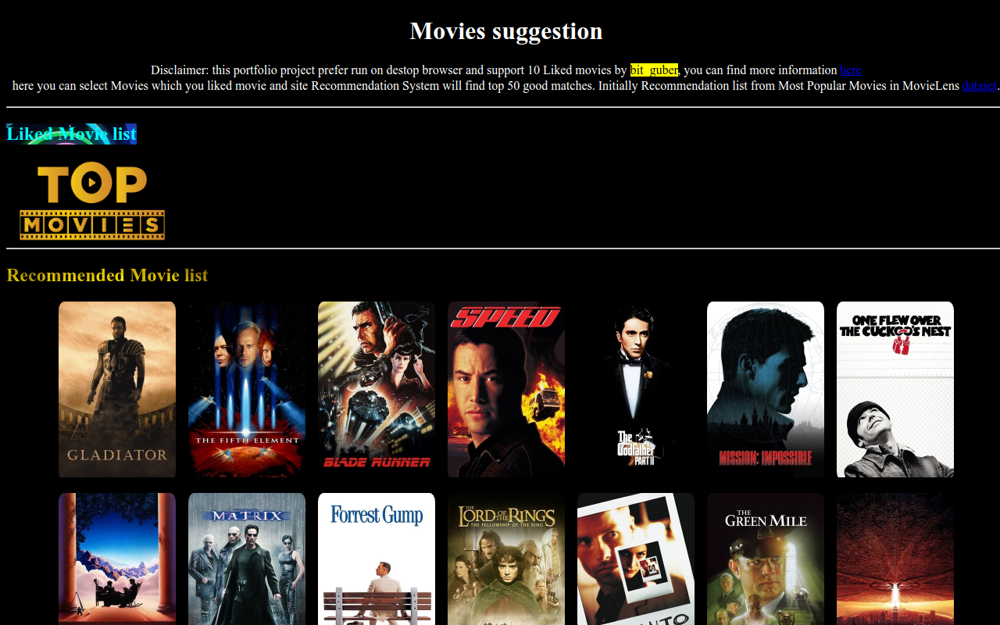

# Data Science Portfolio - Guberan

&nbsp;&nbsp;&nbsp;&nbsp;&nbsp;&nbsp;This Portfolio is a compilation of all the Data Science and Data Analysis projects I have done for academic, self-learning and hobby purposes. This portfolio also contains my skills. It is updated on the regular basis.

- **Email**: [mgrguber@gmail.com](mgrguber@gmail.com)
- **LinkedIn**: [linkedin/bit-guber](https://www.linkedin.com/in/bit-guber)

## Competitions

### [ 
28th place in CommonLit - Evaluate Student Summaries by NLP
 ](https://www.kaggle.com/code/ryanholbrook/evaluate-student-summaries-efficiency-lb)

&nbsp;&nbsp;&nbsp;&nbsp;&nbsp;&nbsp;&nbsp;The goal of this competition is to assess the quality of summaries written by students in grades 3-12. Paticipation will build a model that evaluates how well a student represents the main idea and details of a source text, as well as the clarity, precision, and fluency of the language used in the summary.  

#### I can find my solution [here](https://github.com/bit-guber/CESS-kaggle)

#

#

#

## Projects

 **[
 Movie Recommendation Application 
 ](https://github.com/bit-guber/Movie-Recommender-demo)**

In this project I make <mark>Recommended system</mark> for Movies based on user liked movie collection. It more efficient and Accuracy By using SVD algorithm that trained on MovieLens Dataset. 
It live <a href = "https://bit-guber-movie-recommender.vercel.app/" target="_blank" rel="noopener noreferrer" style = "font-size:20px;font-weight: bold;">now</a> 

#

#

##

 **[
 Crunchyroll Web Scraping and Basic Analysis 
 ](Crunchyroll%20Web%20Scraping/Basic_Analysis.ipynb)**

In this project I make data pipeline from crunchyroll websites scraped data, ETL process scripts and gather few insights of crunchyroll anime community

#

 

## Micro Projects

- ### Random Analysis
  - Simple Analysis of Cardiovascular Diseases Risk Prediction Dataset that present on kaggle [notebook](https://www.kaggle.com/code/bitguber/basic-analysis-brfss-eda)

## Core Competencies

- **Methodologies**: Machine Learning, Deep Learning, Time Series Analysis, Natural Language Processing, Statistics, Explainable AI, A/B Testing and Experimentation Design, Big Data Analytics
- **Languages**: Python (Pandas, Numpy, Scikit-Learn, Scipy, Keras, SeaBorn, Matplotlib), SQL, C++, Rust, Javascript, HTML, CSS
- **Tools**: MySQL, PowerBI, Git, PySpark, MS Excel, Nltk, Transformers models(such as bert, gpt2, deberta-v3, etc..)
